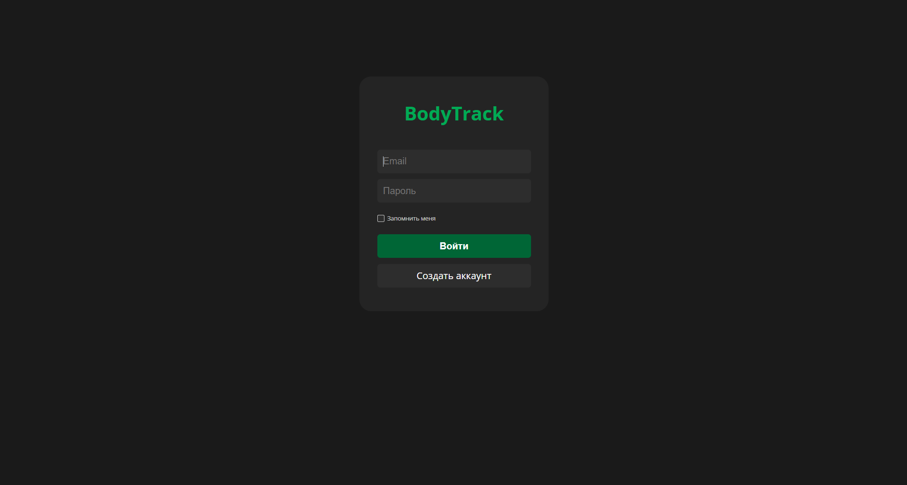
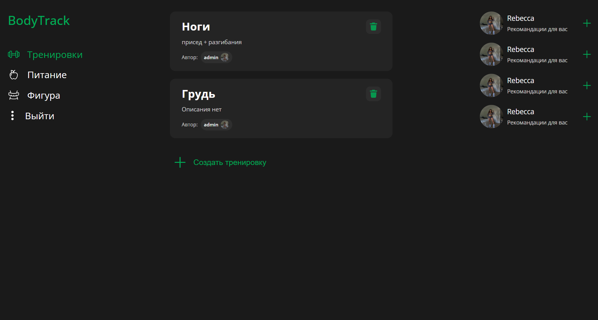
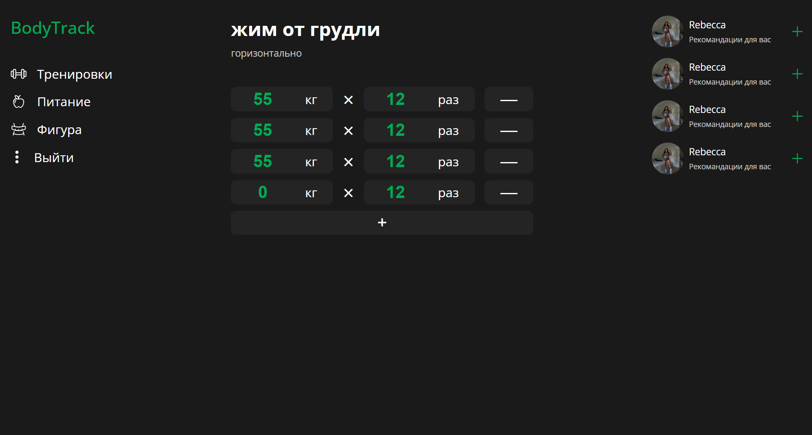
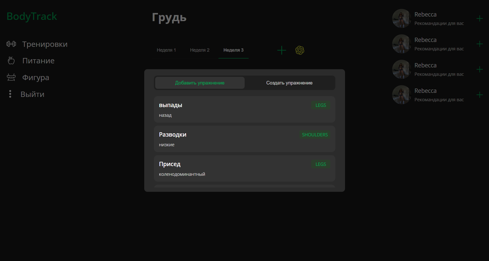
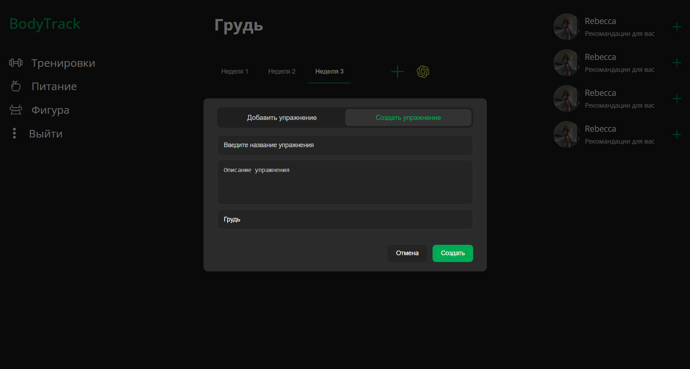
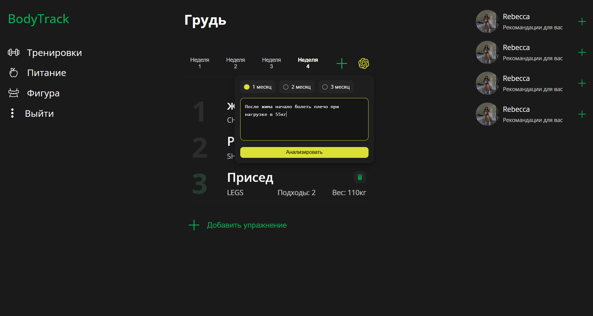
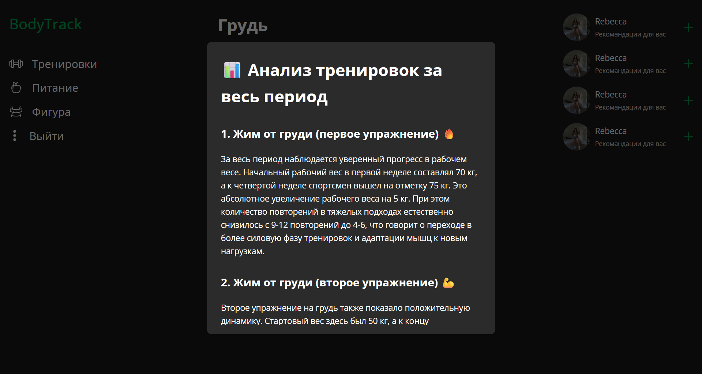
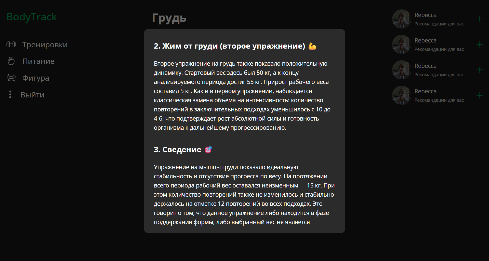

# BodyTrack

> Веб-приложение для анализа тренировочного процесса и генерации персональных рекомендаций с помощью LLM.

BodyTrack собирает историю тренировок, рассчитывает ключевые показатели прогресса и передаёт структурированные данные в LLM для формирования анализа. На основе результатов пользователь может сгенерировать новый тренировочный план, сохраняя историю уже выполненных тренировок.

## Возможности

- Ведение тренировок, упражнений и подходов.
- Анализ прогресса за выбранный период.
- Расчёт метрик Estimated 1RM, Training Volume и Average Repetitions.
- AI-анализ тренировочного процесса.
- Генерация новых тренировочных планов.
- Сохранение нового плана как отдельной тренировочной недели.
- Подбор альтернативных упражнений по мышечной группе.

## Технологический стек

- **Frontend:** React, TypeScript, Redux Toolkit, RTK Query, Vite.
- **Backend:** Node.js, NestJS, Prisma ORM, PostgreSQL.
- **API:** REST API.
- **AI:** OpenAI-compatible API, LLM.
- **Дополнительно:** WebSockets, авторизация, кэширование серверных данных.

## Архитектура

```text
Frontend
   │
   ▼
Backend
   ├── Авторизация и бизнес-логика
   ├── Работа с тренировочными данными
   ├── Расчёт метрик
   ├── Формирование payload для LLM
   └── Сохранение результатов
   │
   ▼
LLM
   ├── Анализ прогресса
   └── Генерация тренировочного плана
```

## Работа с данными

Тренировочный процесс представлен иерархией:

```text
User
 └── Workout
      └── WorkoutExercise
           └── SetWeek
                ├── weight
                ├── reps
                └── orderIndex
```

Упражнения классифицируются по мышечным группам:

```ts
enum MuscleGroup {
  CHEST,
  BACK,
  LEGS,
  SHOULDERS,
  ARMS,
  CORE,
}
```

## Анализ прогресса

Метрики рассчитываются на сервере, после чего в LLM передаются подготовленные временные ряды, а не сырые тренировочные данные.

- **Estimated 1RM** — расчётный максимальный вес на одно повторение.
- **Training Volume** — суммарная нагрузка за период: `weight × reps`.
- **Average Repetitions** — среднее количество повторений за неделю.

Пример payload:

```json
{
  "workoutData": {
    "periodWeeksCount": 4,
    "exercises": [
      {
        "exerciseId": 15,
        "title": "Жим от груди",
        "estimated1RMTrend": [98, 96, 96, 90],
        "volumeTrend": [3090, 2856, 2856, 1900],
        "avgRepsTrend": [11.25, 10, 10, 6.5]
      }
    ]
  }
}
```

## LLM-интеграция

LLM используется как интеллектуальный слой приложения. Сервер отвечает за расчёты, подготовку данных, валидацию ответа и сохранение результата.

Модель анализирует динамику силовых показателей, тренировочного объёма и среднего количества повторений, после чего формирует рекомендации пользователю.

При генерации плана LLM не взаимодействует с базой данных напрямую. Backend получает результат, обрабатывает его и создаёт новую тренировочную неделю.

## Технические особенности

- Разделение аналитики и бизнес-логики.
- Передача в LLM компактного структурированного JSON.
- Сохранение истории тренировок без перезаписи предыдущих недель.
- Работа с реляционной моделью данных через Prisma.
- Кэширование и синхронизация серверных данных через RTK Query.
- Разделение клиентского состояния и серверного состояния.
- Поддержка сложной бизнес-логики генерации тренировочных планов.

## Screenshots

### Авторизация

Страница входа в приложение.



### Главная страница тренировки

Интерфейс просмотра и управления текущей тренировкой.



### Выполнение упражнений

Экран с упражнениями и подходами, где пользователь фиксирует результаты тренировки.



### Добавление упражнения

Модальное окно для добавления нового упражнения в тренировочный план.



### Создание тренировки

Интерфейс создания нового упражнения.



### Анализ тренировочного процесса

Страница с выбором парамтеров анализа.



### Аналитика: показатели

Экраны анализа и рекомендаций по тренировчоному процессу.




